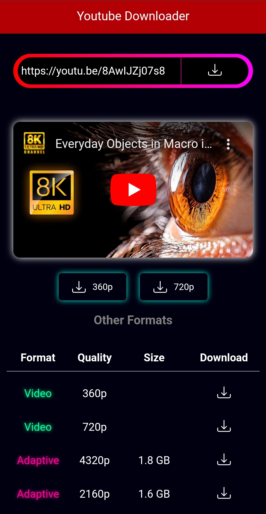
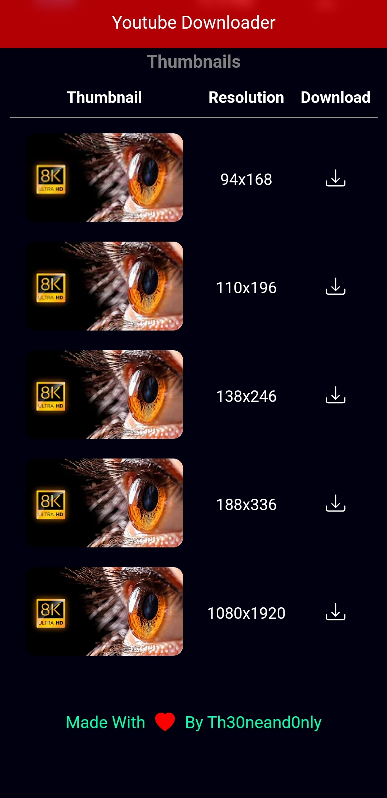

<h1 align=center > YTDL</h1>
<h3 align=center >A simple YouTube Videos/Shorts downloader built in Deno </h3>

### Try It at https://youtube-downloader.deno.dev

### <a href="https://dash.deno.com/new?url=https://raw.githubusercontent.com/prateek-chaubey/ytdl/main/index.ts" >Deploy on Deno </a>

### Screenshots
<table align=center >
<tr>
<td></td>
<td>
</tr>
</table>
